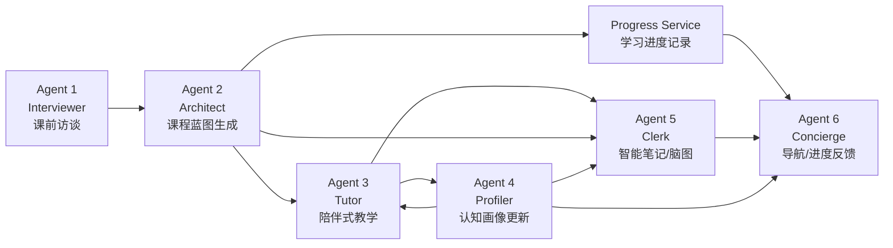

# Agent 系统详解

本文档基于当前仓库代码扫描结果整理，聚焦项目中 README 明确标出的 6 个核心 Agent：

1. Agent 1 `Interviewer`
2. Agent 2 `Architect`
3. Agent 3 `Tutor`
4. Agent 4 `Profiler`
5. Agent 5 `Clerk`
6. Agent 6 `Concierge`

同时，文末会补充说明一个额外存在的通用聊天入口 `app/services/agent_service.py`，因为它不是 README 中的 6 个核心 Agent 之一，但确实属于当前系统的一部分。

---

## 1. 总体结论

这 6 个 Agent 不是“彼此直接调用的 6 个类”，而是 6 组以 `FastAPI Router + Pydantic Schema + Service + 数据库存储 + Qwen LLM` 为核心的业务流程模块。

它们的分工非常明确：

- Agent 1 负责课前访谈，把自然对话沉淀成结构化学习画像。
- Agent 2 负责课程架构设计，把访谈结果转成稳定课程蓝图。
- Agent 3 负责学中陪伴，用课程上下文和思维脚本进行启发式教学。
- Agent 4 负责画像增量更新，把 Tutor 互动反哺成认知画像。
- Agent 5 负责课后整理，把课程、对话和画像合成为智能笔记。
- Agent 6 负责平台层导航和状态反馈，更像系统级 Concierge，而不是讲课导师。

从系统形态看，这 6 个 Agent 构成了一条完整学习闭环：



这条链路的核心设计思想是：

- 先采集学习者信息，再生成课程。
- 课程生成后，Tutor 不再“裸聊”，而是带课程上下文教学。
- Tutor 的互动结果不会直接写回课程，而是通过 Profiler 沉淀为稳定认知画像。
- Clerk 再把课程、对话、画像和观察结果汇总成复盘笔记。
- Concierge 最后负责对前端页面和平台行为做“系统级调度”。

---

## 2. 项目里 6 个 Agent 的位置

### 2.1 代码文件映射

| Agent | 主要 Service | Router | Schema | 主要持久化表 |
| --- | --- | --- | --- | --- |
| Interviewer | `app/services/interview_service.py` | `app/routers/interview.py` | `app/schemas/interview.py` | `interview_sessions` / `interview_messages` / `interview_results` |
| Architect | `app/services/architect_service.py` | `app/routers/architect.py` | `app/schemas/architect.py` | `user_syllabus` |
| Tutor | `app/services/tutor_service.py` | `app/routers/tutor.py` | `app/schemas/tutor.py` | 读取 `user_syllabus` / `user_cognitive_profiles` |
| Profiler | `app/services/profiler_service.py` | `app/routers/profiler.py` | `app/schemas/profiler.py` | `user_cognitive_profiles` / `cognitive_profile_observations` |
| Clerk | `app/services/clerk_service.py` | `app/routers/clerk.py` | `app/schemas/clerk.py` | 读取 `user_syllabus` / `cognitive_profile_observations`，可写 `user_notes` |
| Concierge | `app/services/concierge_service.py` | `app/routers/concierge.py` | `app/schemas/concierge.py` | 读取 `users` / `user_notes` / `user_syllabus` / `user_cognitive_profiles` / `user_learning_progress` |

### 2.2 路由入口

所有 Agent 路由最终都在 `main.py` 中注册到 FastAPI 应用：

- `POST /api/interview/start`
- `POST /api/interview/reply`
- `GET /api/interview/{session_id}`
- `POST /api/architect/generate-course-plan`
- `POST /api/tutor/respond`
- `POST /api/study/tutor-chat/stream`
- `POST /api/profiler/analyze-interaction`
- `GET /api/profiler/profile/{user_id}`
- `POST /api/clerk/generate-note`
- `POST /api/concierge/respond`

项目采用非常典型的薄 Router 设计：

- Router 只接收请求和注入数据库会话。
- Schema 定义输入结构。
- 绝大多数业务都写在 `services/*.py`。

---

## 3. 共通实现模式

6 个 Agent 虽然职责不同，但实现风格高度一致。

### 3.1 共通调用链

```text
HTTP Request
-> FastAPI Router
-> Pydantic Schema 校验
-> Service 构建上下文 / Prompt
-> Qwen(OpenAI 兼容接口) 调用
-> 本地解析 / 归一化 / 兜底
-> SQLAlchemy 持久化
-> JSON Response
```

### 3.2 共通 LLM 基础设施

在 `app/core/config.py` 中：

- 使用 `OpenAI` Python SDK。
- 实际接入的是 Qwen 兼容接口。
- `base_url` 为 `https://dashscope.aliyuncs.com/compatible-mode/v1`。
- 当前代码里调用的模型名统一是 `qwen-plus`。

这意味着从代码结构上看它遵循 OpenAI 风格接口，但底层提供商是 Qwen。

### 3.3 共通工具函数

`app/services/common_service.py` 提供了几个关键基础函数：

- `ensure_list(value)`：把字符串或列表统一转成字符串列表。
- `parse_json_response(content)`：解析 LLM 返回 JSON，顺手剥掉可能的 ```json 代码块。
- `merge_unique_items(existing, new_items)`：去重合并列表，适合做画像增量更新。

### 3.4 共通设计特点

- 需要结构化结果时，几乎都会要求 LLM 输出合法 JSON。
- 关键流程后面通常还有一层本地归一化，不完全信任模型原始输出。
- 数据协作不是通过“Agent 直接调用 Agent”，而是通过数据库共享状态。
- Prompt 里普遍写了很强的行为约束，尤其是“不许猜”“不许直接给答案”“必须输出 JSON”。

---

## 4. Agent 1: Interviewer

### 4.1 职责定位

Agent 1 是整条链路的起点，负责做课前访谈。它的本质不是“和用户随便聊聊”，而是把用户的学习情况采集为结构化槽位，再沉淀为后续 Agent 可消费的 `interview_result`。

它负责回答的问题包括：

- 学习者基础如何
- 学习目标是什么
- 当前卡点在哪里
- 偏好什么讲解方式

### 4.2 输入接口

Schema：`app/schemas/interview.py`

#### 开始访谈 `StartInterviewRequest`

主要字段：

- `user_id`
- `course_id`
- `course_type`
- `course_title`
- `course_summary`
- `key_topics`
- `rag_summary`
- `history_profile`
- `interview_config`

其中 `interview_config` 默认包含：

- `max_questions=6`
- `target_duration_min=3`
- `ask_one_question_only=True`

#### 回复访谈 `ReplyInterviewRequest`

- `session_id`
- `user_message`

### 4.3 核心数据结构

在 `app/services/interview_service.py` 中，Agent 1 定义了 4 个必须收集的槽位：

- `foundation`
- `goal`
- `pain_point`
- `preference`

默认槽位状态格式为：

```json
{
  "foundation": {
    "status": "missing",
    "value": null,
    "evidence": ""
  }
}
```

每个槽位都有：

- `status`：`missing` 或 `filled`
- `value`：真实内容
- `evidence`：证据说明

### 4.4 关键函数

主要函数如下：

- `build_default_slot_state()`：初始化四个槽位。
- `build_interview_context()`：整理课程上下文。
- `build_question_for_slot()`：按槽位生成标准提问。
- `build_retry_question_for_slot()`：低质量回复时改写追问。
- `analyze_interview_turn()`：把完整访谈对话发给 LLM 做结构化分析。
- `reply_interview_flow()`：整个访谈主流程。
- `build_completion_payload()`：生成最终结构化访谈结果。

### 4.5 访谈执行流程

#### 第一步：创建会话

`start_interview_flow()` 做了这些事：

1. 生成访谈上下文。
2. 初始化 4 个槽位。
3. 生成一个以 `iv_` 开头的会话 ID。
4. 默认直接问 `foundation`，并且带开场说明。
5. 写入数据库：
   - `InterviewSession`
   - 一条 assistant 开场消息 `InterviewMessage`

它返回：

- `session_id`
- 首个 `agent_reply`
- `finished=False`
- 当前槽位状态

#### 第二步：接收用户回复

`reply_interview_flow()` 是最关键的流程：

1. 查 `InterviewSession`。
2. 如果 session 已完成，直接返回已有结果，不再继续访谈。
3. 把用户回复写入 `InterviewMessage`。
4. 取出当前 `slot_state`、历史消息、上一个 assistant 回复。
5. 调用 `analyze_interview_turn()` 让 LLM 输出：
   - `slot_updates`
   - `should_finish`
   - `termination_reason`
   - `assistant_reply`
   - `next_question_slot`
   - `interview_summary`
6. 用 LLM 结果更新槽位。
7. 如果当前槽位仍没填满，再尝试本地 fallback。
8. 根据规则判断是否结束访谈。
9. 若结束，则写 `InterviewResult`；否则继续追问下一个槽位。

### 4.6 Prompt 约束与模型职责

`analyze_interview_turn()` 给 LLM 的系统提示很明确：

- 根据课程上下文和完整对话更新四个槽位。
- 只能把明确表达过的信息标记为 `filled`。
- 信息足够或用户要求直接开始时，可以结束访谈。
- 如果还不能结束，只生成下一句“单次单问”的自然问题。
- 不讲课，不给课程方案，不长篇解释。
- 必须输出合法 JSON。

换句话说，Agent 1 的 LLM 并不负责知识教学，而是负责对“访谈状态机”做结构化决策。

### 4.7 本地兜底逻辑

Agent 1 的一个亮点，是它不是完全依赖 LLM。

#### 低质量回复识别

`is_low_signal_reply()` 会把这些回复视为低信号：

- 空字符串
- 单字符或“1/2/3”
- `ok`、`好的`、`行`
- 某些槽位上的 `都行`、`随便`、`不知道`

#### 本地槽位补录

`build_local_slot_update()` 会在 LLM 失效或结果不足时，尝试用当前回复直接填充当前槽位。

例如：

- `foundation`、`goal` 直接保留原文本
- `pain_point`、`preference` 会强制转成列表

#### 重复问题改写

如果下一轮问题和上轮 assistant 的内容一样，或者 LLM 没给新问题，系统会自动退回 `build_retry_question_for_slot()`，避免机械重复。

### 4.8 结束条件

访谈在以下情况之一满足时结束：

- 用户触发“直接开始/跳过访谈”等关键词
- 四个槽位都已填满
- 已达到 `max_questions`
- 模型认为可以结束，且至少已经填满 3 个槽位

这一点很重要：系统对“模型说结束”做了二次约束，不是无条件信任。

### 4.9 持久化设计

Agent 1 读写三个表：

- `InterviewSession`
  - 会话级状态
  - 当前槽位状态
  - 最大问题数
  - 课程上下文
- `InterviewMessage`
  - 访谈消息历史
- `InterviewResult`
  - 最终结构化结果
  - 终止原因

最终产物 `interview_result` 里包括：

- `interview_summary`
- `interview_trace`
- `termination_reason`

其中 `interview_trace` 是问答轨迹，后续可以用于可解释性回放。

### 4.10 输出价值

Agent 1 的直接产出不是课程，而是“可供 Agent 2 消费的学习者输入画像”。这一步决定了后面课程蓝图是否真正个性化。

### 4.11 当前实现观察

- `target_duration_min` 和 `ask_one_question_only` 目前主要进入 context，没有被本地流程强约束。
- 访谈摘要支持 LLM 输出，也支持本地 `build_local_interview_summary()` 兜底生成。
- 代码对 LLM 异常有较强容错，测试里也验证了 fallback 能工作。

---

## 5. Agent 2: Architect

### 5.1 职责定位

Agent 2 负责把 Agent 1 的访谈结果转化为课程蓝图。它不是简单生成一段介绍文案，而是生成一个适合前端渲染、可继续用于 Tutor/Clerk/Progress 的结构化课程计划。

它输出的是整个平台的“学习骨架”。

### 5.2 输入接口

Schema：`app/schemas/architect.py`

主要字段：

- `user_id`
- `course_id`
- `course_type`
- `course_title`
- `course_summary`
- `key_topics`
- `rag_summary`
- `interview_session_id`
- `interview_result`
- `architect_config`

默认配置：

- `chapter_count=4`
- `min_sections_per_chapter=2`
- `max_sections_per_chapter=4`
- `questions_per_section=2`

### 5.3 上游依赖

Agent 2 强依赖 Agent 1。

`resolve_architect_inputs()` 的逻辑是：

1. 如果提供了 `interview_session_id`，就去查 `InterviewSession` 和 `InterviewResult`。
2. 如果请求里直接带了 `interview_result`，优先可以直接用。
3. 如果没有 `InterviewResult`，但有 `InterviewSession`，就会基于消息历史和当前槽位调用 `build_completion_payload()` 做兜底。
4. 如果两者都没有，直接报错：
   - `Agent 2 需要 Agent 1 的访谈结果。请传 interview_session_id 或 interview_result。`

所以从真实依赖上看，Agent 2 的最小前提是“有访谈摘要”，不一定必须拿已有 `InterviewResult` 表记录。

### 5.4 核心函数

- `resolve_architect_inputs()`：解析上下文和访谈结果来源。
- `generate_course_plan_flow()`：课程蓝图生成主流程。
- `normalize_course_plan()`：对 LLM 输出做结构化归一化。

其中 `normalize_course_plan()` 实际位于 `app/services/course_service.py`，是 Agent 2 的关键后处理。

### 5.5 Prompt 设计

Agent 2 的系统 Prompt 要求很像“课程结构生成器”：

- 读取课程上下文和访谈结果。
- 按用户基础、目标、痛点和偏好调整难度和顺序。
- 标准课优先围绕 `key_topics`。
- 自定义课优先围绕 `rag_summary` 的资料主题和关键词。
- 每章要有学习目标。
- 每节要有学习目标和练习题。
- 目录必须稳定，不能是“自由探索”式流程。
- 每章至少若干小节。
- 每小节至少若干练习题。
- `practice_questions` 的每题必须包含：
  - `type`
  - `question`
  - `answer`
  - `explanation`
  - `hint`
  - 选择题还必须有 `options`

并且强制输出合法 JSON。

### 5.6 课程蓝图归一化

Agent 2 的真正稳定性，不只来自 Prompt，还来自 `normalize_course_plan()` 的后处理。

它会做这些事：

#### 章节与小节命名修复

- 如果章节标题是空的、占位的，会用课程上下文自动生成回退标题。
- 如果小节标题是空的、占位的，也会自动生成可用标题。

#### 小节目标修复

- 若 LLM 未提供 `objective`，会基于标题自动生成一个默认学习目标。

#### 练习题结构修复

- 每道题都会被标准化成统一结构。
- 非法类型会回退为 `short_answer`。
- 如果练习题数量不足，会自动补足 fallback 题目。

#### 元数据补充

最终返回的课程计划会带上：

- `learner_profile`
- `interview_session_id`
- `metadata.agent = "architect"`
- `metadata.version = "v1"`
- `metadata.question_count`

### 5.7 持久化设计

Agent 2 最终把课程蓝图写入 `UserSyllabus` 表：

- `user_id`
- `course_id`
- `syllabus_data`

如果记录已存在则覆盖更新，不存在则新建。

这张表非常关键，因为后面的 Agent 3、4、5、Progress、Concierge 都会读取它。

### 5.8 输出价值

Agent 2 产出的不只是一个 syllabus，而是全局共享学习上下文，里面至少包含：

- 课程标题和说明
- 学习者画像
- 推荐起点
- 章节树
- 小节目标
- 练习题

它本质上是后续所有智能学习行为的“课程真相源”。

### 5.9 当前实现观察

- `chapter_count` 与 `max_sections_per_chapter` 虽然在配置中存在，也会被放进 `generation_rules`，但本地后处理没有强制校验，只能部分依赖模型遵守。
- `min_sections_per_chapter` 和 `questions_per_section` 的约束更强，因为后者至少有本地题目补足逻辑。
- 该模块已有测试覆盖“正常生成”和“标题/题目自动补全”两个重要场景。

---

## 6. Agent 3: Tutor

### 6.1 职责定位

Agent 3 是真正与学习者高频互动的陪伴导师。它的设计目标不是给标准答案，而是做带上下文、带画像、带教学风格的启发式辅导。

它同时承担两种场景：

- 课程内按小节进行陪伴式教学
- 针对当前题目做苏格拉底式引导

### 6.2 输入接口

Schema：`app/schemas/tutor.py`

主要字段：

- `messages`
- `question_context`
- `user_action`
- `tutor_style`
- `user_id`
- `course_id`
- `chapter_id` / `chapter_title`
- `section_id` / `section_title`
- `difficulty_preference`
- `thinking_script`

其中：

- `messages` 是实际对话历史。
- `question_context` 是题目描述或上下文。
- `user_action` 描述用户当前行为。
- `thinking_script` 支持外部直接覆盖。

### 6.3 Tutor 的上下文拼装

`build_tutor_context()` 是 Agent 3 的核心前置函数。

它会做三件事：

#### 1. 加载课程蓝图

如果传了 `user_id + course_id`，就查 `UserSyllabus`，拿到课程计划。

然后通过 `resolve_tutor_section_context()` 定位到：

- 当前课程
- 当前章节
- 当前小节
- learner_profile

如果没传定位字段，默认会尽量回落到第一章第一节。

#### 2. 加载思维方式脚本

Tutor 会优先级加载“思维脚本”：

1. 请求里显式传入 `thinking_script`
2. 数据库 `UserCognitiveProfile`
3. 从课程蓝图里的 `learner_profile` 兜底推导

对应来源标记为：

- `request_override`
- `database_profile`
- `learner_profile_fallback`

#### 3. 归一化思维脚本

`normalize_thinking_script()` 会统一生成这些字段：

- `preferred_explanation_styles`
- `reasoning_preferences`
- `hint_preference`
- `difficulty_preference`
- `motivation_hooks`
- `friction_points`
- `response_pacing`
- `encouragement_style`

### 6.4 Tutor Prompt 的核心约束

Agent 3 的系统 Prompt 是整个项目里最具教学风格的一个。

它会同时把以下信息喂给模型：

- 当前课程名
- 当前章节
- 当前小节
- 当前小节目标
- 当前小节关键点
- 当前章节目标
- 学习者画像
- 思维脚本
- 当前题目上下文
- 用户当前行为

同时还写死了以下核心行为规则：

1. 必须使用苏格拉底式教学法。
2. 严禁直接给最终答案、完整代码、完整解题步骤、正确选项字母。
3. 用户强要答案时，也只能拒绝后给最小提示。
4. 知识延伸时可以展开解释，但结尾尽量自然拉回当前小节或题目。
5. 解释方式优先匹配思维脚本。
6. 用户卡住时，一次只给一步提示。
7. 涉及代码时只能给局部片段、伪代码或排查方向。
8. 默认 Markdown，且控制在 3 个短段落以内。
9. 每次回复结尾尽量给出一个具体下一步。

这是一个典型的“受约束教学 Agent”，而不是普通聊天机器人。

### 6.5 消息构建

`build_tutor_messages()` 会生成最终消息序列：

1. 先放系统 Prompt。
2. 如果有 `question_context` 或 `user_action`，再塞一条 user 消息作为结构化上下文补充。
3. 再拼接真实会话历史 `messages`。

这样做的好处是：

- 模型先看到“规则”和“课程位置”
- 再看到题目/行为上下文
- 最后才进入自然对话历史

### 6.6 输出方式

Agent 3 有两种输出形式：

#### 普通响应

`POST /api/tutor/respond`

返回：

- `reply`
- `context.course_plan_found`
- `context.thinking_script_source`
- `context.learner_profile`
- `context.section_context`

#### 流式响应

`POST /api/study/tutor-chat/stream`

使用 SSE 风格流式输出：

- 每个 chunk 以 `data: ...` 形式吐出
- 没有额外的完成事件协议

### 6.7 当前实现边界

Tutor 本身不负责把对话写回数据库。也就是说：

- Tutor 负责“当下教”
- Profiler 负责“事后理解用户”

这是一个很清晰的职责切分。

### 6.8 当前实现观察

- Tutor 的教学质量高度依赖 Agent 2 的课程蓝图质量和 Agent 4 的认知画像质量。
- 如果没有课程蓝图，也能工作，但上下文会明显变弱。
- 当前仓库里还没有看到专门覆盖 Tutor 主流程的服务级测试，这是后续值得补的点。

---

## 7. Agent 4: Profiler

### 7.1 职责定位

Agent 4 不直接面对学习目标本身，而是观察 Tutor 和用户互动时的“行为信号”，将其抽象成稳定认知画像。

它的作用是把一次次局部对话，累积成可长期复用的学习偏好模型。

### 7.2 输入接口

Schema：`app/schemas/profiler.py`

主要字段：

- `user_id`
- `course_id`
- `chapter_id` / `chapter_title`
- `section_id` / `section_title`
- `interaction_type`
- `tutor_style`
- `question_context`
- `user_action`
- `user_message`
- `tutor_reply`
- `user_feedback`
- `messages`
- `thinking_script_snapshot`
- `learner_profile_snapshot`

这说明 Profiler 可以分析：

- 单轮交互
- 带上下文的多轮对话
- 外部补充的快照

### 7.3 上下文解析

`resolve_profiler_context()` 会做三层上下文拼装：

1. 从 `UserSyllabus` 里解析当前章节/小节上下文。
2. 从请求里的 `learner_profile_snapshot` 获取学习者画像快照，若无则退回课程蓝图里的 `learner_profile`。
3. 从 `UserCognitiveProfile` 里读取当前已有认知画像。

如果请求里传了 `thinking_script_snapshot`，还会直接覆盖到已有 profile 上。

### 7.4 画像字段设计

Profiler 维护的画像字段比 Tutor 更丰富，分成两类。

#### 列表类字段

- `preferred_explanation_styles`
- `reasoning_preferences`
- `motivation_hooks`
- `friction_points`
- `confidence_signals`
- `avoid_patterns`
- `effective_analogy_topics`

#### 标量字段

- `hint_preference`
- `difficulty_preference`
- `response_pacing`
- `encouragement_style`
- `preferred_challenge_mode`

此外还有：

- `evidence_history`
- `last_summary`
- `last_updated_reason`
- `version`
- `updated_at`

### 7.5 交互转录构建

`build_profiler_transcript()` 会把一次互动压缩成文本摘要：

- 题目上下文
- 用户当前行为
- 导师风格
- 最近最多 8 条消息
- 用户最新表达
- 导师最近回复
- 用户反馈

这一步的作用是把前端/业务层零散字段统一转成便于 LLM 观察的“事件文本”。

### 7.6 Prompt 设计

Profiler 的 Prompt 非常明确，重点不在总结知识点，而在识别学习偏好信号：

- 哪种讲解方式更有效
- 用户喜欢怎样的提示节奏
- 何种难度更合适
- 哪些表达会让用户更有动力
- 哪些模式会让用户更容易困惑

Prompt 特别强调：

- 证据不足就不要更新画像
- `should_update` 可以为 `false`
- 但即使不更新，也要给 `summary`

这使得 Profiler 不是“每次都改画像”，而是有一定保守性。

### 7.7 更新合并策略

`merge_cognitive_profile_updates()` 是 Profiler 的关键实现细节。

它不会简单覆盖旧画像，而是：

- 列表字段用 `merge_unique_items()` 去重合并
- 标量字段只在新值是有效非空字符串时才替换
- `evidence_history` 会追加新证据，最多保留最近 20 条
- 更新 `last_summary`
- 更新 `last_updated_reason`
- 统一写 `version="v1"` 和 `updated_at`

这种设计对画像系统很重要，因为认知画像应当是累积式，而不是一次分析把过去全覆盖。

### 7.8 持久化设计

Profiler 一次调用会涉及两个表：

#### `user_cognitive_profiles`

当 `should_update=True` 时，更新或创建这张表的用户画像。

#### `cognitive_profile_observations`

无论是否更新画像，都会写一条 observation，内容包含：

- summary
- confidence
- should_update
- interaction_type
- analysis_result
- course_context

这意味着系统同时保留：

- 长期稳定画像
- 最近若干次局部观察记录

### 7.9 对其他 Agent 的价值

Profiler 的输出会直接影响：

- Tutor：读取认知画像生成思维脚本
- Clerk：读取 recent observations 组织笔记
- Concierge：平台快照里会包含认知画像

所以 Agent 4 是“学习偏好反馈环”的核心。

### 7.10 当前实现观察

- Profiler 已有测试覆盖“成功更新画像并写 observation”。
- 即使不更新画像，也会保留观察记录，这个设计对后续可解释性很好。
- 当前画像结构相对灵活，但仍是 JSON blob，没有更细颗粒度的关系型拆表。

---

## 8. Agent 5: Clerk

### 8.1 职责定位

Agent 5 是课后整理者。它不是单纯“根据聊天记录生成总结”，而是把课程结构、章节位置、用户画像、最近认知观察、当前对话和练习题一起整合，输出一份带行动建议的智能笔记。

它的定位更接近“学习复盘助手”。

### 8.2 输入接口

Schema：`app/schemas/clerk.py`

主要字段：

- `user_id`
- `course_id`
- `chapter_id` / `chapter_title`
- `section_id` / `section_title`
- `note_title`
- `focus_questions`
- `messages`
- `user_takeaways`
- `additional_context`
- `auto_save`
- `include_mindmap`

### 8.3 前置依赖

Clerk 必须依赖 Agent 2 先生成课程蓝图。

`resolve_clerk_context()` 一开始就会查询 `UserSyllabus`，如果没有课程计划，直接报错：

- `未找到该课程的课程蓝图，请先完成 Agent 2`

这说明 Agent 5 在设计上不是一个独立通用笔记器，而是课程体系内部的智能笔记组件。

### 8.4 上下文拼装

Clerk 会整合以下信息：

1. 课程蓝图 `course_plan`
2. 当前章节/小节上下文 `section_context`
3. 当前学习者画像 `learner_profile`
4. Tutor/Profiler 推导出的 `thinking_script`
5. 最近最多 6 条 `CognitiveProfileObservation`
6. 当前小节练习题 `practice_questions`
7. 最近对话摘要 `recent_dialogue_digest`

这是 6 个 Agent 里“上下文来源最多”的一个。

### 8.5 Prompt 设计

Clerk 的系统 Prompt 明确要求输出 JSON：

```json
{
  "title": "笔记标题",
  "content": "Markdown 正文，末尾包含 mermaid mindmap 代码块"
}
```

其中 `content` 必须至少包含：

1. `### 本章核心结构`
2. `### 当前小节精华`
3. `### 这次学习里的易错点`
4. `### 下一步行动`

如果 `include_mindmap=True`，还要在末尾附上 Mermaid `mindmap` 代码块。

Prompt 同时要求：

- 内容必须贴合学习者画像和思维脚本
- 要有陪伴感
- 不要写成空泛教程
- 要能帮助用户看清“核心结构 + 易错点 + 下一步”

### 8.6 标题与内容兜底

如果模型没有返回标题，系统会使用 `build_default_note_title()` 自动生成，例如：

- `课程名 - 小节标题 学习笔记`
- `课程名 - 章节标题 复盘笔记`
- `课程名 智能学习笔记`

如果模型没返回 `content`，会直接报错：

- `Agent 5 未返回有效笔记内容`

### 8.7 持久化设计

当 `auto_save=True` 时：

- Clerk 会写入 `UserNote`
- 返回 `saved_note_id`

当 `auto_save=False` 时：

- 不保存笔记
- 代码里会执行一次 `db.rollback()`

这里的 `rollback()` 本质上是为了确保本次请求不留下未提交写入，虽然当前主流程里大多数前置操作都是读操作。

### 8.8 对系统的意义

Agent 5 实际上把前面多个 Agent 的结果做了“知识封装”：

- Agent 2 提供课程结构
- Agent 3 提供近期教学互动
- Agent 4 提供学习偏好和观察证据

最终形成对用户可见的复盘材料。

### 8.9 当前实现观察

- Clerk 的上下文整合很强，说明它不是简单 summarizer。
- 当前仓库中没有看到专门覆盖 Clerk 生成流程的服务测试。
- 由于它依赖 `UserSyllabus`，课程蓝图的结构质量会直接影响笔记生成质量。

---

## 9. Agent 6: Concierge

### 9.1 职责定位

Agent 6 是平台级全局助手，不是学科导师。它更接近“学习平台操作中枢”：

- 回答用户“我学到哪了”
- 带用户回到课程
- 打开笔记
- 建议前端切主题
- 在必要时给出平台操作指引

它的重点是导航和执行建议，不是深度教学。

### 9.2 输入接口

Schema：`app/schemas/concierge.py`

主要字段：

- `user_id`
- `message`
- `current_page`
- `course_id`
- `allow_frontend_actions`
- `available_frontend_actions`
- `context`

其中值得注意：

- `allow_frontend_actions` 会影响是否允许系统返回前端动作建议。
- `available_frontend_actions` 和 `context` 当前 schema 中存在，但在 service 里基本未被实际使用。

### 9.3 平台快照构建

`build_concierge_snapshot()` 会聚合：

- `User`
- 最近 5 条 `UserNote`
- 当前用户全部 `UserSyllabus`
- `build_user_progress_overview()` 生成的课程进度概览
- `UserCognitiveProfile`

再整理为一个 snapshot，包含：

- 用户背景
- 课程列表
- 进度概览
- 最近笔记
- 认知画像

这使 Agent 6 本质上拥有平台级状态视角。

### 9.4 路由判断和前端动作判断

Agent 6 先做两层规则判断。

#### 路由识别 `detect_concierge_route()`

会基于关键词把请求归类为：

- `learning_progress`
- `platform_navigation`
- `notes_navigation`
- `course_navigation`
- `platform_help`
- `general_support`

#### 前端动作识别 `detect_frontend_action()`

会根据用户文本直接推断前端动作，例如：

- 切暗色主题
- 切亮色主题
- 打开笔记页
- 回到课程页

如果是回到课程，还会尽量带上当前 `course_id` 和 `section_id`。

### 9.5 规则优先，LLM 兜底

`concierge_respond_flow()` 的策略不是一上来就调模型，而是：

1. 先构建 snapshot。
2. 先做 route 判断。
3. 如果允许，则先推断 frontend_action。
4. 如果 route 是 `learning_progress`，直接走本地 `build_progress_reply()`。
5. 否则先尝试 `build_concierge_rule_response()`。
6. 只有规则系统无法覆盖时，才调用 `build_concierge_llm_response()`。

这是一个很典型的“规则优先、模型兜底”的系统 Agent 设计。

### 9.6 本地规则响应

#### 学习进度

`build_progress_reply()` 会优先使用 `progress_overview` 第一门课的数据，生成类似：

- 最近在学哪门课
- 已完成多少小节
- 当前在什么位置

#### 笔记导航

直接建议跳到 notes 页面。

#### 课程导航

如果有进度记录，则建议回到当前课程和当前小节。

#### 主题切换

如果识别到 dark/light，直接返回 `set_theme` 前端动作。

### 9.7 LLM 响应结构

当规则不足时，LLM 也必须返回固定 JSON：

```json
{
  "reply": "给用户看的自然语言回复",
  "route": "learning_progress|platform_navigation|notes_navigation|course_navigation|platform_help|general_support",
  "suggested_frontend_action": {
    "type": "navigate|set_theme|none",
    "payload": {}
  }
}
```

说明 Concierge 的模型能力也被严格限制在“短回复 + 路由 + 前端动作建议”这个范围内。

### 9.8 输出价值

Agent 6 最终返回的是：

- `reply`
- `route`
- `frontend_action`
- `snapshot` 的简化版

这里的 snapshot 只回传：

- `courses`
- `progress_overview`
- `recent_notes`

也就是说，系统不会把完整用户画像原样暴露给前端响应层。

### 9.9 当前实现观察

- Agent 6 的本质是“前端交互编排器”。
- `learning_progress` 场景完全不依赖 LLM，这提高了稳定性。
- `available_frontend_actions` 当前未真正参与动作裁决。
- `build_concierge_snapshot()` 查询用户时使用 `User.username == user_id`，说明当前系统里 `user_id` 在这里更像 username，而不是 `users.id` 整数主键，这是一个值得注意的数据约定点。

---

## 10. Agent 间协作关系

### 10.1 标准协作链

最标准的链路是：

1. 用户开始访谈，Agent 1 采集结构化画像。
2. Agent 2 根据访谈结果生成课程蓝图，并写入 `UserSyllabus`。
3. Agent 3 依据课程蓝图和思维脚本做陪伴式教学。
4. Agent 4 分析 Tutor 互动，把偏好沉淀为 `UserCognitiveProfile`。
5. Agent 3 下一轮再读取更新后的画像，提高教学个性化。
6. Agent 5 结合课程、对话、画像和观察结果生成学习笔记。
7. Progress Service 记录学习进度。
8. Agent 6 综合课程、进度、笔记做平台层反馈和导航。

### 10.2 共享数据中心

真正把这些 Agent 串起来的，是数据库里的共享状态，而不是直接函数调用。

关键共享表如下：

| 表名 | 主要被谁写 | 主要被谁读 |
| --- | --- | --- |
| `interview_sessions` | Interviewer | Interviewer / Architect |
| `interview_messages` | Interviewer | Interviewer / Architect |
| `interview_results` | Interviewer | Architect |
| `user_syllabus` | Architect | Tutor / Profiler / Clerk / Progress / Concierge |
| `user_cognitive_profiles` | Profiler | Tutor / Concierge |
| `cognitive_profile_observations` | Profiler | Clerk / Profiler |
| `user_notes` | Clerk | Concierge |
| `user_learning_progress` | Progress Service | Concierge |

### 10.3 设计上的分层意义

这套设计有一个明显优点：

- 每个 Agent 都可以单独演进 Prompt 和业务逻辑
- 只要共享表结构和字段约定不变，就不会强耦合

这比把所有行为塞进一个超大 Agent 更可维护。

---

## 11. 课程上下文与画像上下文是如何复用的

项目里有两个非常关键的跨 Agent 上下文载体。

### 11.1 课程上下文

课程上下文主要来自 `UserSyllabus.syllabus_data`，由 Agent 2 写入。

后续通过 `resolve_tutor_section_context()` 解析，供以下模块复用：

- Tutor
- Profiler
- Clerk
- Progress

这套上下文里包含：

- 课程标题和描述
- learner_profile
- recommended_start_point
- 章节信息
- 小节信息
- key_points
- practice_questions

### 11.2 认知画像上下文

认知画像主要来自 `UserCognitiveProfile.profile_json`，由 Profiler 写入。

Tutor 和 Clerk 并不会原样使用它，而是会通过 `normalize_thinking_script()` 做二次整理，抽取为更适合教学和笔记生成的字段。

这形成了一个很清晰的关系：

- Profiler 负责“理解用户”
- Tutor/Clerk 负责“使用理解结果”

---

## 12. 测试覆盖情况

当前仓库中的 `tests/test_service_flows.py` 已覆盖的关键行为有：

- Interviewer 正常开始并生成结构化访谈结果
- Interviewer 在 LLM 失败时使用本地 fallback
- Interviewer 在低信号回复时改写问题而不是原样重复
- Architect 正常生成并持久化课程蓝图
- Architect 能自动补全缺失标题、目标和练习题
- Profiler 能更新认知画像并写 observation
- Progress Service 能更新并计算学习进度

### 12.1 已有测试能证明什么

- Agent 1 和 Agent 2 的“结构化结果 + 兜底逻辑”是经过验证的。
- Agent 4 的画像落库逻辑也是经过验证的。
- 课程计划会真正被后续进度服务消费。

### 12.2 当前明显缺口

当前没有看到专门覆盖以下模块的服务级测试：

- Tutor
- Clerk
- Concierge

这三个模块更依赖 Prompt 质量与上下文拼装，后续如果要稳定演进，建议补 mock LLM 测试。

---

## 13. 这 6 个 Agent 的优势与当前边界

### 13.1 优势

#### 1. 角色切分清楚

每个 Agent 的职责边界比较干净，没有把“访谈、课程规划、教学、画像、笔记、导航”糊成一个巨型模块。

#### 2. 共享状态设计合理

通过数据库表协作，让 Agent 间是“弱耦合协作”，而不是函数级强耦合。

#### 3. 对 LLM 有结构化约束

凡是需要稳定结构的地方，都强制 JSON 输出，并在本地做二次修复。

#### 4. 有本地 fallback

尤其是 Interviewer 和 Architect，不完全依赖模型一次生成正确结果。

#### 5. 真正形成学习闭环

访谈 -> 课程 -> 教学 -> 画像 -> 笔记 -> 平台导航，这条链路逻辑是完整的。

### 13.2 当前边界与潜在改进点

#### 1. 有些配置字段还没被强约束执行

例如：

- `InterviewConfig.target_duration_min`
- `InterviewConfig.ask_one_question_only`
- `ArchitectConfig.chapter_count`
- `ArchitectConfig.max_sections_per_chapter`

它们目前更多是提示模型，而不是本地硬规则。

#### 2. Tutor 不主动留痕

Tutor 负责回答，但不负责写学习交互日志；Profiler 的调用需要外部业务层主动触发。

#### 3. Concierge 的前端动作能力还比较关键词驱动

目前是基于关键词匹配的 `detect_frontend_action()`，还没有和 `available_frontend_actions` 做更严格的能力约束。

#### 4. 画像与课程结构都存 JSON

灵活，但也意味着：

- 查询粒度有限
- 约束主要靠代码约定
- 未来做统计分析时可能需要更多投影字段

#### 5. Tutor/Clerk/Concierge 测试仍不足

这些模块当前更依赖“Prompt 约束是否工作”，后面应该补齐 mock LLM 单测。

---

## 14. 额外说明：通用 `agent_service`

除了上面 6 个核心 Agent，项目里还存在一个通用入口：

- Router：`app/routers/agent.py`
- Service：`app/services/agent_service.py`

它提供两个接口：

- `POST /api/agent/chat`
- `POST /api/agent/chat/stream`

这个模块的特点是：

- 会从 `User` 和 `KnowledgeMastery` 里拼接“用户背景 + 薄弱知识点”到系统提示中。
- 普通模式下更像一个带记忆的通用导师聊天。
- 流式模式里，若没有 `current_question`，会以“课程规划师”的身份收集基础、目标、学习时间。
- 若有 `current_question`，则切到“AI 编程私教”身份，并区分“原题求助”和“知识延伸”两种策略。

这个模块更像历史兼容层或总入口封装，不是 README 中那条 6 Agent 学习闭环的严格组成部分。

---

## 15. 一句话总结每个 Agent

- Agent 1 `Interviewer`：把模糊需求聊清楚，沉淀成结构化学习画像。
- Agent 2 `Architect`：把学习画像落成稳定课程蓝图。
- Agent 3 `Tutor`：带课程上下文和认知脚本做启发式教学。
- Agent 4 `Profiler`：把一次次互动变成可累积的认知画像。
- Agent 5 `Clerk`：把课程、对话、画像与观察整理成高质量复盘笔记。
- Agent 6 `Concierge`：把课程、进度、笔记和平台操作整合为系统级导航与反馈。

如果只看系统本质，这 6 个 Agent 共同构成的是一个“以课程蓝图为骨架、以认知画像为反馈回路、以平台导航为收口”的个性化学习后端。
