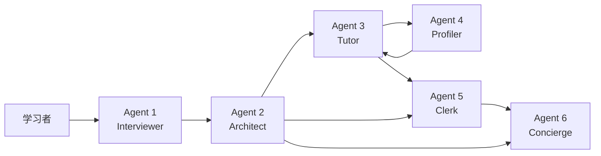

# Personalized Learning Assistant 项目背景企划书

## 1. 项目概述

`Personalized Learning Assistant` 是一套面向个性化学习场景的智能学习平台后端系统，当前后端基于 `FastAPI + SQLAlchemy + Qwen(OpenAI 兼容接口)` 构建，核心能力围绕 6 个 Agent 展开，覆盖“课前访谈、课程规划、陪伴教学、认知画像、笔记整理、平台导航”完整闭环。

与传统在线教育产品不同，本项目并不把 AI 仅仅当作一个通用问答工具，而是把 AI 设计为多个有明确职责边界的智能角色，让系统能够围绕“用户是谁、要学什么、当前卡在哪里、应该如何继续推进”持续工作。这种设计目标不是单次回答问题，而是帮助用户形成持续学习、结构化学习和可追踪学习。

从项目当前形态来看，它已经具备一个智能学习平台后端雏形：

- 有结构化用户访谈能力
- 有课程蓝图自动生成能力
- 有基于课程上下文的陪伴式教学能力
- 有学习画像沉淀能力
- 有笔记与脑图生成能力
- 有进度反馈和前端动作建议能力

因此，这个项目可以被定义为：

**一个以多 Agent 协作驱动的个性化学习辅助平台后端。**

---

## 2. 项目背景

### 2.1 教育与学习场景的现实问题

当前数字化学习产品普遍存在三个核心矛盾：

1. 内容很多，但不一定适合当前用户。  
   大量课程平台提供海量课程与资料，但用户面对内容时经常不知道该从哪里开始，也不知道当前最适合自己的学习顺序。

2. 工具很多，但缺少连续陪伴。  
   搜索引擎、问答助手、在线视频、题库平台都能解决局部问题，但它们往往无法形成一个持续跟踪用户状态、理解用户卡点、随着用户进展动态调整策略的系统。

3. 学习过程很长，但反馈往往很弱。  
   用户经常会经历“开始很积极、学习中途迷失、后期缺乏总结”的全过程。缺少合适的反馈机制时，学习平台很难真正提升留存和完成率。

尤其在编程学习、技能培训、知识型课程等场景中，这些问题更明显：

- 用户基础差异极大
- 学习目标差异极大
- 课程内容有明显前后依赖
- 单次答疑不能解决长期能力建设问题
- 学习者更需要陪伴、分层引导和过程复盘

### 2.2 大模型带来的新机会

大模型让“个性化解释、动态追问、上下文生成、知识重组、风格化输出”变得可行，但如果只是把大模型包装成一个聊天框，通常会出现几个问题：

- 回答看似聪明，但没有系统记忆
- 每轮对话像第一次见面，缺少连续性
- 不知道用户学到哪里了
- 不知道什么样的讲法最适合用户
- 容易从“教学”退化成“直接给答案”

因此，真正可落地的 AI 学习产品，不应该只是“接入一个模型”，而应该把模型放进一个有流程、有角色、有状态、有反馈的系统中。

本项目正是在这样的背景下提出：

**利用多 Agent 协作，把大模型从一次性问答工具升级为面向学习过程管理的智能系统。**

### 2.3 项目切入点

本项目选择从后端能力层切入，而不是先做花哨前端，原因在于：

- 个性化学习的核心壁垒在于“流程编排与状态沉淀”
- 多 Agent 的职责边界需要在后端先稳定
- 数据结构、课程蓝图、学习画像和进度管理都必须有统一真相源
- 前端体验可以迭代，但后端能力模型必须先打稳

因此，当前版本的重点是：

- 完成核心 Agent 模块化
- 打通学习闭环
- 建立后续产品化扩展的能力底座

---

## 3. 项目愿景与定位

### 3.1 项目愿景

打造一个真正“理解学习者、伴随学习者、推动学习者完成目标”的智能学习系统，让 AI 从“回答问题的人”升级为“帮助用户完成学习的人”。

### 3.2 项目定位

本项目不是简单的聊天机器人，也不是通用课程平台，而是：

**一个以学习任务推进为中心、以个性化课程编排和智能陪伴为核心能力的 AI 学习引擎。**

### 3.3 产品定位语

可以将本项目的外部定位表述为：

**面向技能学习场景的个性化 AI 学习助教平台。**

或者更进一步：

**帮助用户从“想学”走到“学会”的多 Agent 个性化学习系统。**

---

## 4. 目标用户与核心场景

### 4.1 目标用户画像

项目适合的初始核心用户包括：

#### 1. 编程与技术学习用户

- 希望学习 Python、Java、前端、算法、后端开发等内容的学生或职场人
- 已有碎片知识，但缺乏系统化路线的学习者
- 在刷题、做项目、准备面试时需要持续陪伴的人群

#### 2. 职业技能提升用户

- 有明确工作需求，希望在短期内掌握某项技能
- 学习时间有限，希望获得更高效学习路径
- 不想被大而全课程拖住，希望快速定位个人关键卡点

#### 3. 自定义资料学习用户

- 拥有个人讲义、培训文档、内部资料、PDF 资料的人群
- 希望把现有资料转化为结构化学习路径和可互动学习过程

### 4.2 典型使用场景

#### 场景 A：新手入门

用户对某门课程几乎零基础，但希望快速入门。系统先通过访谈判断基础和目标，再生成更适合新手的课程顺序与陪伴方式。

#### 场景 B：带目标学习

用户学习目标非常明确，例如“为了面试学 Java 并发”“为了工作看懂线程池参数”。系统需要围绕目标而不是围绕教材目录组织课程。

#### 场景 C：学习中途卡住

用户已经在某个章节学习，但频繁在相似问题上卡住。系统应识别其认知偏好，调整提示方式，而不是反复输出相同风格答案。

#### 场景 D：学习后复盘沉淀

用户上完一节课后，需要一份不是“照抄教材”的笔记，而是与自己卡点和理解方式匹配的复盘笔记与脑图。

#### 场景 E：平台内连续学习

用户希望回到上次学习位置、查看自己的学习进度、打开最近笔记、继续课程。系统需要提供平台级路由与反馈能力。

---

## 5. 用户痛点分析

### 5.1 学前痛点

- 不知道自己适合从哪里开始
- 不确定该先补基础还是直接奔目标
- 不知道系统是否真正理解自己的情况

### 5.2 学中痛点

- 教学解释风格不匹配
- 一次讲太多，跟不上
- 学习过程中容易偏离重点
- 缺少针对当前课程位置的上下文指导

### 5.3 学后痛点

- 学完后没有高质量总结
- 易错点没有被沉淀
- 不知道下一步应该学什么

### 5.4 平台使用痛点

- 找不到当前学习位置
- 不清楚自己完成了多少内容
- 平台功能多但入口不明确

### 5.5 本项目对应策略

| 用户痛点 | 对应能力 |
| --- | --- |
| 不知道从哪开始 | Interviewer + Architect |
| 教学不贴合自己 | Tutor + Profiler |
| 学完无法沉淀 | Clerk |
| 找不到进度和入口 | Concierge + Progress |

---

## 6. 项目核心解决方案

本项目的解决方案不是“一个万能 AI”，而是“一个多角色协作系统”。

### 6.1 六大 Agent 能力闭环

### 6.2 各 Agent 的业务角色

#### Agent 1 `Interviewer`

负责在学习开始前理解用户：

- 当前基础
- 学习目标
- 当前卡点
- 讲解偏好

它将自然对话转换为结构化访谈结果，为后续课程生成提供依据。

#### Agent 2 `Architect`

负责将访谈结果转化为课程蓝图：

- 章节结构
- 小节目标
- 练习题
- 推荐起点
- 学习者画像嵌入

它是课程级真相源。

#### Agent 3 `Tutor`

负责学中陪伴：

- 带课程上下文回答问题
- 使用苏格拉底式教学
- 避免直接给最终答案
- 根据学习者偏好动态调整讲法

#### Agent 4 `Profiler`

负责学习偏好沉淀：

- 识别哪种讲法更有效
- 提炼提示偏好、激励点、易卡点
- 将局部互动积累为长期认知画像

#### Agent 5 `Clerk`

负责学习复盘：

- 整理当前章节核心结构
- 提炼当前小节精华
- 总结这次学习的易错点
- 给出下一步行动建议
- 可附带 Mermaid 脑图

#### Agent 6 `Concierge`

负责平台级引导：

- 回答学习进度
- 引导跳转课程或笔记
- 建议前端执行主题切换等动作
- 提供页面级导航与操作建议

---

## 7. 项目价值主张

### 7.1 对用户的价值

#### 1. 更适合自己的学习路径

通过访谈和课程蓝图机制，用户不再面对一套固定课程，而是面对为自己当前目标和基础重新组织过的学习路线。

#### 2. 更连续的学习体验

系统不只回答单个问题，而是知道用户是谁、在哪一节、卡在哪里、该继续什么。

#### 3. 更符合个人认知方式的讲解

通过 Profiler 持续沉淀认知画像，Tutor 不再每次都“重头猜测”，而是越来越贴合个人风格。

#### 4. 更强的学习沉淀感

Clerk 可以把每次学习沉淀为笔记、结构化总结和脑图，提升复习与迁移效率。

### 7.2 对平台的价值

#### 1. 提高留存

相比一次性问答工具，连续学习体验更有机会提升用户回访和长期留存。

#### 2. 提高完成率

通过进度反馈、路线清晰化和复盘强化，用户更容易走完一门课程。

#### 3. 提高差异化

很多产品都能接入大模型，但能否形成多 Agent、课程上下文、认知画像、学习闭环，决定了产品是否真正有壁垒。

#### 4. 提高后续商业化空间

一旦平台掌握课程蓝图、学习画像和过程数据，就具备做高级课程服务、企业培训、定制学习包等扩展空间。

---

## 8. 项目核心设计思想

### 8.1 从“答疑系统”升级为“学习系统”

传统 AI 学习工具的问题在于：

- 回答很快，但不一定真的推动学习
- 对话很多，但没有长期记忆
- 内容丰富，但缺少目标驱动

本项目的设计思想是把学习拆成一个完整过程：

`理解用户 -> 设计路径 -> 陪伴学习 -> 观察反馈 -> 生成复盘 -> 推进下一步`

也就是说，系统真正服务的是“学习过程”，而不是单次响应。

### 8.2 从“单 Agent”升级为“多角色分工”

如果只有一个 Agent，通常会出现角色冲突：

- 既要访谈，又要规划，又要教学，又要总结
- Prompt 会越来越大，边界越来越模糊
- 状态和职责容易混在一起

本项目选择拆分为 6 个 Agent，目的在于：

- 提升每个模块的可维护性
- 降低 Prompt 职责冲突
- 便于后续独立迭代和测试

### 8.3 从“即时回答”升级为“状态驱动”

系统核心不是“模型说了什么”，而是“系统知道了什么、保存了什么、下次能接着做什么”。

所以项目特别强调：

- 结构化访谈结果
- 课程蓝图持久化
- 用户认知画像
- 学习进度记录
- 复盘笔记沉淀

这些都是平台长期价值的基础。

---

## 9. 当前技术与产品基础

### 9.1 当前技术基础

项目当前已完成模块化重构，具备以下基础：

- `FastAPI` 作为后端 Web 框架
- `SQLAlchemy` 作为 ORM 与数据层
- `Pydantic` 作为请求结构校验层
- `Qwen(OpenAI 兼容接口)` 作为大模型服务接入
- 按 `router / schema / service / model` 分层组织

### 9.2 当前产品能力基础

结合当前仓库实现，已经落地的产品能力包括：

- 访谈会话与结果存储
- 课程蓝图自动生成与持久化
- 带课程上下文的陪伴导师对话
- 认知画像分析与 observation 记录
- 智能笔记与脑图生成
- 学习进度更新与概览
- 平台导航与前端动作建议

### 9.3 当前阶段判断

从产品阶段看，当前项目处于：

**“后端核心能力已成型，适合进入联调验证与产品打磨阶段。”**

它已经不再是概念验证最初期，而是：

- 核心能力链路已打通
- 数据结构已经出现稳定雏形
- 可以开始围绕真实用户体验做前后端联调和策略优化

---

## 10. 产品差异化分析

### 10.1 相比传统在线课程平台

传统课程平台的问题是：

- 课程目录固定
- 课程内容对所有人一刀切
- 学习中缺少动态陪伴
- 学完后沉淀弱

本项目的差异化在于：

- 课程不是固定推送，而是根据访谈结果组织
- 教学不是统一讲法，而是根据认知画像调整
- 过程不是断裂的，而是连续推进的

### 10.2 相比通用 AI 聊天助手

通用助手的问题是：

- 不了解课程上下文
- 不知道用户目标
- 不记录学习进度
- 无法形成稳定复盘

本项目的差异化在于：

- 有课程上下文
- 有学习画像
- 有学习状态
- 有平台级闭环

### 10.3 相比单 Agent 学习产品

单 Agent 容易出现：

- Prompt 巨大
- 职责混乱
- 不利于测试和演进

本项目的差异化在于：

- 角色切分清楚
- 上下游关系明确
- 容易做局部优化

---

## 11. 商业与应用想象空间

### 11.1 面向 C 端个人学习

可以作为：

- AI 编程助教
- 个人学习管家
- 个性化课程规划工具

适合的变现方式包括：

- 订阅制会员
- 高级课程包
- 高级学习复盘功能
- 更强模型额度/高级陪伴功能

### 11.2 面向 B 端培训机构

可以作为：

- 培训课程智能化底座
- 学员分层辅导系统
- 企业内部知识学习助手

适合的合作模式包括：

- SaaS 服务
- 企业私有化部署
- 定制行业知识学习包

### 11.3 面向学校或教育组织

可以作为：

- 学习过程辅助系统
- 课前摸底与分层辅导工具
- 课后复盘与学习反馈平台

---

## 12. 阶段目标与推进策略

### 12.1 第一阶段：核心闭环验证

目标：

- 验证 6 个 Agent 的联动效果
- 跑通从访谈到课程到教学再到复盘的主链路
- 完成基础前后端联调

重点任务：

- 补充接口文档
- 明确前端字段对接
- 完善 Tutor / Clerk / Concierge 的测试
- 通过真实用例验证链路体验

### 12.2 第二阶段：体验优化与稳定性建设

目标：

- 提升 Agent 输出稳定性
- 提升数据结构一致性
- 降低 LLM 不稳定带来的体验波动

重点任务：

- 增加更多 fallback 逻辑
- 补充 mock LLM 单元测试
- 引入数据库 migration
- 完善日志与监控

### 12.3 第三阶段：产品化增强

目标：

- 打磨用户旅程
- 强化运营能力
- 建立可持续增长与转化路径

重点任务：

- 增加更细的学习行为埋点
- 建立用户分层和学习效果分析
- 设计会员能力与增值服务
- 提升课程导入和自定义资料适配能力

---

## 13. 项目成功的关键指标

### 13.1 产品指标

- 用户完成首轮访谈的比例
- 课程蓝图生成成功率
- Tutor 会话持续轮次
- 学习笔记保存率
- 用户回访率
- 单课程完成率

### 13.2 体验指标

- 用户对课程路径匹配度的主观满意度
- Tutor 回复是否真正帮助理解
- 认知画像是否提升后续解释效果
- 笔记内容是否具有复习价值

### 13.3 系统指标

- LLM 接口成功率
- JSON 解析成功率
- 各 Agent 主流程失败率
- 关键接口平均响应时间

---

## 14. 风险与挑战

### 14.1 大模型输出稳定性风险

挑战：

- JSON 输出可能不稳定
- 课程结构可能不完全满足要求
- Tutor 风格可能偶发漂移

建议：

- 强化本地归一化与容错
- 增加更细粒度测试
- 做 Prompt 版本管理

### 14.2 长链路协作风险

挑战：

- 上游产物质量会影响下游体验
- 例如访谈不准确会影响课程蓝图，课程蓝图又会影响 Tutor 和 Clerk

建议：

- 提高关键中间结果可视化能力
- 为 `interview_result`、`syllabus_data`、`profile_json` 建立更强校验

### 14.3 产品体验一致性风险

挑战：

- 多 Agent 虽然职责清晰，但也更容易出现整体风格不一致

建议：

- 统一平台级语气与交互规范
- 建立 Prompt 编写规范和评审机制

### 14.4 数据层扩展风险

挑战：

- 当前较多结构存于 JSON 字段，灵活但对统计分析和复杂查询不够友好

建议：

- 在后续版本中逐步补充投影字段或分析型表结构

---

## 15. 项目未来演进方向

### 15.1 更强的学习诊断能力

未来可以在访谈和学习过程中加入：

- 更细粒度知识掌握度判断
- 更强的错题与薄弱点追踪
- 更动态的课程重规划能力

### 15.2 更强的自定义资料学习能力

当前系统已经具备 `rag_summary` 相关上下文能力，未来可以继续增强：

- 多文档资料导入
- 资料切片与知识点抽取
- 资料驱动的自定义课程蓝图生成

### 15.3 更强的多模态学习能力

未来可延展到：

- 图解学习
- 视频片段总结
- 白板式教学
- 图文混合脑图生成

### 15.4 更强的运营与管理能力

未来可以扩展：

- 学习报告
- 班级或群组学习管理
- 企业/机构教学仪表盘
- 学习过程数据分析后台

---

## 16. 结论

`Personalized Learning Assistant` 项目的价值，不在于“又接了一个大模型”，而在于它试图把 AI 真正放进学习过程管理中，让系统能够围绕用户状态持续工作。

这个项目瞄准的是一个长期存在但一直没有被很好解决的问题：

**学习产品如何真正做到因人而异，并且持续推动用户完成学习目标。**

从当前实现来看，项目已经具备非常清晰的方向：

- 用 Agent 访谈理解用户
- 用课程蓝图组织内容
- 用陪伴导师推动学习
- 用认知画像实现反馈闭环
- 用智能笔记沉淀学习成果
- 用平台助手完成系统级收口

如果后续继续补强联调、测试、稳定性和产品体验，这个项目具备从“智能后端原型”走向“真正可落地的个性化学习平台”的潜力。

---

## 17. 附录：一句话版本

如果需要非常简洁地描述本项目，可以使用下面这句话：

**Personalized Learning Assistant 是一个基于多 Agent 协作的个性化学习平台后端，旨在通过访谈、课程规划、陪伴教学、认知画像、学习复盘与平台导航，帮助用户从“想学”走到“学会”。**
